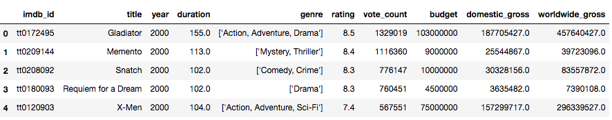
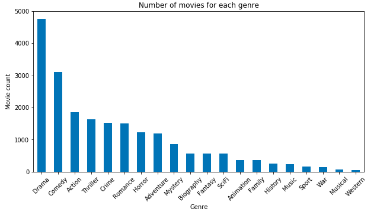
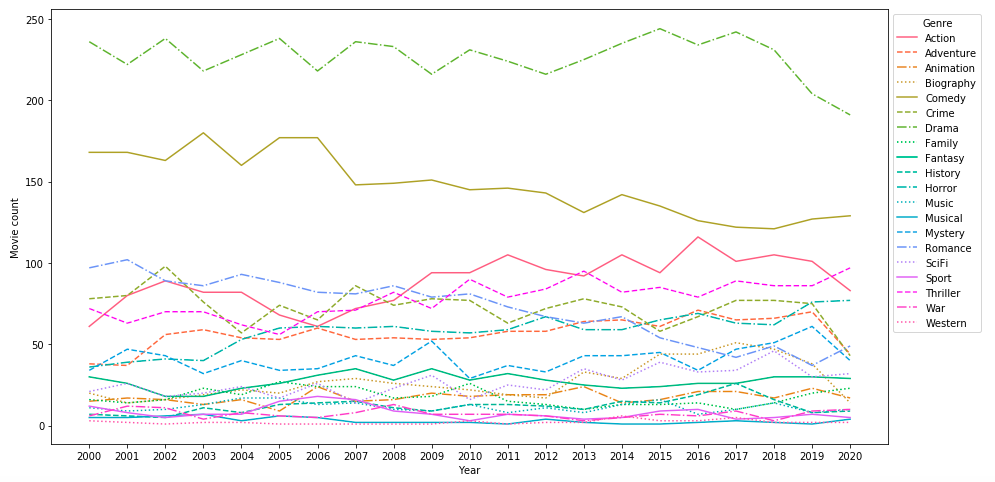
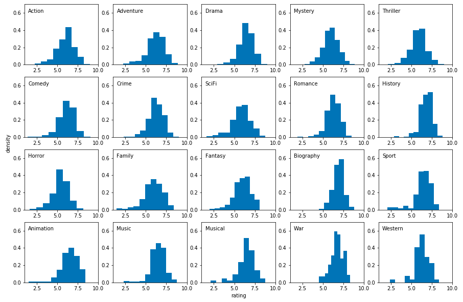

# IMDb Movie Data Analysis (2000 - 2020)

#### Author: Ziqi (Katie) Chen

## Introduction

Many movies with huge budgets often bring huge profits, like Avatar, Star Wars, The Avengers. There are low-budget movies that also made millions, such as Paranormal Activity, The Blair Witch Project, Juno etc. It seems like Action and Adventure movies are most profitable as they often have large budgets for famous casts and special effects. However, these types of movies may not have the most return on investment. To study further, I analyzed IMDb movie data between 2000 and 2020 using Exploratory Data Analysis and Visualization. In particular, I did my analysis on answering the following questions:

* What genres are most popular each year? Do people like certain genres over time?
* What type of movie receive higher rating?
* Which genre is most profitable? What genres are associated with higher budgets?
* Which genre has the biggest return on investment (ROI)?

## Data Source

There are two datasets that I used in this analysis:
* IMDb movie data (scraped from [IMDb website](https://www.imdb.com/))
* Kaggle movie data (csv file from [Kaggle Movie Dataset](https://www.kaggle.com/rounakbanik/the-movies-dataset))

The movie data that I scraped from IMDb was filtered by year from 2000 to 2020. Each year I picked 400 movies by descending voting count, so there are total 8400 movies in the dataset. However, there is no budget information when the data was scraped from the IMDb website. I then used the budget information from Kaggle movie data and merged it to the IMDb dataset so that I had all important information.

These are columns from the dataset that I want:
* IMDb id
* Movie title
* Released year
* Duration (min)
* Genre (one movie can have multiple genres)
* Rating (out of 10)
* Vote Count
* Budget
* Domestic gross
* Worldwide gross

## Data Analysis

After data cleaning, the dataset looks like this:

### What genre is most popular?

It looks like the number of Drama movies are the largest, which indicates Drama is the most popular genre, followed by Comedy, Action and Thriller. Western is the least popular genre since there are very few Western movies. We will break down movie counts by year to study how the genre popularity changes over time.

### How does movie genre popularity change over time?

The plot shows that Drama is still the most popular genre all the time but the number of Drama movies has decreased since 2017. The number of Comedy movies is the second largest but it has decreased since 2006.  
There were more Romance movies in early 2000s, but Action and Thriller movies have become more popular since 2009.  
The number of movies for other genres is consistent. There are very few Musical and Western movies each year, which means Musical and Western genres are not popular all the time.

### Movie rating distribution by genre from 2000 to 2020

The rating distribution of each genre is slightly left-skewed, and the majority of movies in each genre have rating from 5 to 7. Most movies with History, Biography and War genres have higher rating which is above 6 and very few of them have lower rating.

Movie Genre | Average Rating | Movie Genre | Average Rating
----------- | -------------- | ----------- | --------------
Biography | 6.9 | Crime | 6.2
History | 6.8 | Adventure | 6.2
War | 6.7 | Comedy | 6.1
Animation | 6.5 | Action | 6.0
Music | 6.5 | Mystery | 6.0
Musical | 6.5 | Fantasy | 6.0
Drama | 6.4 | Family | 5.9
Sport | 6.4 | Thriller | 5.9
Romance | 6.3 | SciFi | 5.9
Western | 6.2 | Horror | 5.4

Biography movies have the highest average rating, followed by History and War. Horrer movies receive the lowest average rating. Even though there are not many History, War and Musical movies each year, these movies tend to receive higher rating compared to other genres.

### Which genre is most profitable?

One of factors that determine the success of a movie is revenue. Knowing what type of movie is most profitable helps movie investors make business decisions. In this section we will explore budget and revenue for each genre and factors that affect movie revenue.

We can see that Animation, Musical and Adventure movies have greater domestic revenue than other genres. History movies have very low revenue and War movies do not have domestic revenue. This might explain why there are very few movies in these genres in the market.

## Conclusions
