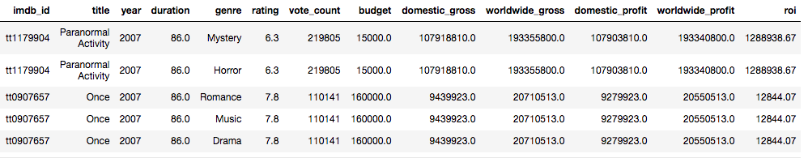

# IMDb Movie Data Analysis (2000 - 2020)

#### Author: Ziqi (Katie) Chen

## Introduction

Many movies with huge budgets often bring huge profits, like Avatar, Star Wars, The Avengers. There are low-budget movies that also made millions, such as Paranormal Activity, The Blair Witch Project, Juno etc. It seems like Action and Adventure movies are most profitable as they often have large budgets for famous casts and special effects. However, these types of movies may not have the most return on investment. To study further, I analyzed IMDb movie data between 2000 and 2020 using Exploratory Data Analysis and Visualization. In particular, I did my analysis on answering the following questions:

* What genres are most popular each year? Do people like certain genres over time?
* What type of movie receive higher rating?
* Which genre is most profitable? What genres are associated with higher budgets?
* Which genre has the biggest return on investment (ROI)?

## Data Source

There are two datasets that I used in this analysis:
* IMDb movie data (scraped from [IMDb website](https://www.imdb.com/))
* Kaggle movie data (csv file from [Kaggle Movie Dataset](https://www.kaggle.com/rounakbanik/the-movies-dataset))

The movie data that I scraped from IMDb was filtered by year from 2000 to 2020. Each year I picked 400 movies by descending voting count, so there are total 8400 movies in the dataset. However, there is no budget information when the data was scraped from the IMDb website. I then used the budget information from Kaggle movie data and merged it to the IMDb dataset so that I had all important information.

These are columns from the dataset that I want:
* IMDb id
* Movie title
* Released year
* Duration (min)
* Genre (one movie can have multiple genres)
* Rating (out of 10)
* Vote Count
* Budget
* Domestic gross
* Worldwide gross

## Data Analysis

After data cleaning, the dataset looks like this:

### What genre is most popular?

It looks like the number of Drama movies are the largest, which indicates Drama is the most popular genre, followed by Comedy, Action and Thriller. Western is the least popular genre since there are very few Western movies. We will break down movie counts by year to study how the genre popularity changes over time.

### How does movie genre popularity change over time?

The plot shows that Drama is still the most popular genre all the time but the number of Drama movies has decreased since 2017. The number of Comedy movies is the second largest but it has decreased since 2006.  
There were more Romance movies in early 2000s, but Action and Thriller movies have become more popular since 2009.  
The number of movies for other genres is consistent. There are very few Musical and Western movies each year, which means Musical and Western genres are not popular all the time.

### Movie rating distribution by genre from 2000 to 2020

The rating distribution of each genre is slightly left-skewed, and the majority of movies in each genre have rating from 5 to 7. Most movies with History, Biography and War genres have higher rating which is above 6 and very few of them have lower rating.

Movie Genre | Average Rating | Movie Genre | Average Rating
----------- | -------------- | ----------- | --------------
Biography | 6.9 | Crime | 6.2
History | 6.8 | Adventure | 6.2
War | 6.7 | Comedy | 6.1
Animation | 6.5 | Action | 6.0
Music | 6.5 | Mystery | 6.0
Musical | 6.5 | Fantasy | 6.0
Drama | 6.4 | Family | 5.9
Sport | 6.4 | Thriller | 5.9
Romance | 6.3 | SciFi | 5.9
Western | 6.2 | Horror | 5.4

Biography movies have the highest average rating, followed by History and War. Horrer movies receive the lowest average rating. Even though there are not many History, War and Musical movies each year, these movies tend to receive higher rating compared to other genres.

### Which genre is most profitable?

One of factors that determine the success of a movie is revenue. Knowing what type of movie is most profitable helps movie investors make business decisions. In this section we will explore budget and revenue for each genre and factors that affect movie revenue.

We can see that Animation, Musical and Adventure movies have greater domestic revenue than other genres. History movies have very low domestic revenue and War movies do not have domestic revenue. This might explain why there are very few movies in these genres in the market.

Animation and Adventure movies also have most worldwide revenue, followed by SciFi and Fantasy movies. War movies have the lowest worldwide revenue.

One thing that surprises me is that Crime and Action movies do not make much revenue since these genres are popular. After looking into detail, I found out that some Crime and Action movies have huge budgets but only made little profits. For example, Crime movie Live by Night has $65 million budgets but only made $10 million in the US. Action movie John Carter has $250 million budgets and only made $73 million in the US. Even though Action movies did not make much revenue in the US, they earned a lot through international box office sales. 

### Which genre is associated with higher budget?

From the barplot we see that Adventure, SciFi and Animation movies have higher budgets. Horror and Music movies have the lowest budgets.

We notice that War, History and Crime movies have the average domestic revenue below $2 million but their budgets are between $33 million and $40 million. This is not a good sign for movie investors to invest in these types of movies.

By looking at the average budget and revenue for each genre, it is still hard to conclude what type of movie is worth to invest in as some types of movie with high revenue often have high budgets, such as Adventure and Animation movies. Therefore, we need to look at the return on investment (ROI) for each genre to determine what genre has the best return.

### Which genre has the biggest return on investment (ROI)?

Return on investment (ROI) is a measure of the efficiency of an investment. It is calculated as profit divided by budget. Here we used worldwide revenue to calculate ROI.

The plot shows that there is an unusual peak in 2007, and it happens to both Horror and Mystery genres. This is an indication of outliers, which some movies might have very low budgets but made huge revenue. I removed these outliers in order to get accurate result for each genre.

We can see that the movie Paranormal Activity in 2007 had a budget of $15,000 and worldwide gross of $193,340,800 for a return of 1,288,938.67%, which the average ROI will not reflect the true insight if I include it. The genres for this movie are Horror and Mystery, that is why there is a peak in the plot above.

After removing this outlier, the plot looks like this:

* Horror movies had very large ROI in 2003 and 2015, and overall this type of movie had a large ROI all the time.
* Mystery movies did not have ROI as large as Horror movies, but this genre also had good ROI.
* Thriller, Fantasy, Romance movies had ROI under 500% each year before 2016, but their ROI has increased a lot in 2017.
* Most of the time War and Western movies had the lowest ROI.

## Conclusions

Results that we take away with this report are:

* Drama, Comedy and Action genres are most popular genres. War, Western and Musical genres are not favored by the majority.
* While the number of Comedy movies is the second largest, it has decreased over time.
* Most movies have rating between 5 and 7. History, Biography and War movies tend to have higher rating. Horror movies have the lowest average rating.
* Animation and Adventure movies are most profitable. War movies made the least revenue.
* Adventure, Animation and SciFi movies have large budgets while they brought huge revenue. Horror and Music movies have the lowest budgets. War, History and Crime movies made way less money compared to their large budgets.
* Horror and Mystery movies have the best ROI. Thriller, Fantasy and Romance movies are also worth to invest in. War and Western movies have the lowest ROI compared to other genres.
